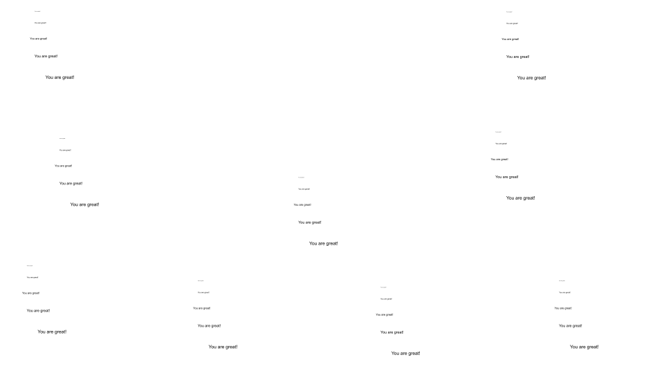

# zoom_in
# EyeSayCorrect: Eye Gaze and Voice Based Hands-free Text Correction for Mobile Devices
Maozheng Zhao, Henry Huang, Zhi Li, Rui Liu, Wenzhe Cui, Kajal Toshniwal, Ananya Goel, Andrew Wang, Xia Zhao, Sina Rashidian, Furqan Baig, Khiem Phi, Shumin Zhai, I.V. Ramakrishnan, Fusheng Wang, and Xiaojun Bi.  
Stony Brook University, Google LLC

